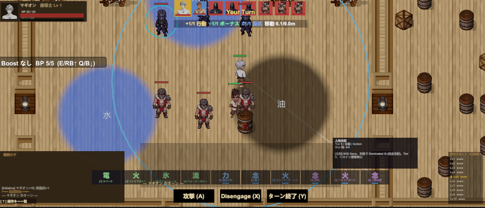

# ElnaiaProject ― 個人開発ポートフォリオ

Unity で個人制作しているファンタジー・タクティカルRPG **ElnaiaProject** の、開発とデバッグの取り組みをまとめたポートフォリオです。

> このリポジトリは、セガのデバッグ業務への応募にあたり、個人開発で日常的に行っている「実装 → テスト → 不具合の再現特定 → 修正 → 再確認」の進め方を紹介するためのものです。ゲーム本体のソースコードは別で管理しています。

---

## 制作中のゲーム：ElnaiaProject

| 項目 | 内容 |
|------|------|
| ジャンル | ファンタジー世界を舞台にしたタクティカルRPG（ターン制の戦略的な戦闘） |
| 開発体制 | 企画・シナリオ・実装・デバッグ／テストまでを個人で一貫して担当 |
| エンジン | Unity 2022.3（C#） |
| バージョン管理 | GitHub（ソースコードと作業ドキュメント） |

---

## 開発・デバッグの進め方

- 実装した機能は、Unity の実行（Play）画面で毎回動作を確認しています。
- 不具合を見つけたら「どの操作で・どんな条件で起きるか」を切り分け、**再現手順を記録**してから修正し、修正後に再確認します。
- 作業の区切りごとに、変更点・既知の不具合・修正内容を **「作業ログ」** として文書に残しています。

この「テストして、再現手順を書いて、直して、また確かめる」という流れは、デバッグ業務そのものと同じだと考えています。

---

## デバッグ事例

個人開発の中で実際に発見・修正した不具合の例です。**症状 → 切り分け → 原因 → 対応 → この事例で示せること** の順で整理しています。

### 事例1：常設の地形効果（炎・油の床）が表示されず、効果も発動しない

- **症状**：マップに常設したはずの「油」「火」の床が、表示も効果も出ない状態が続いていました。
- **切り分け**：動作ログを仕込み、床の登録数が「0」（一度も登録されていない）ことを確認。登録処理の戻り記録が出ていない箇所を突き止めました。
- **原因**：登録処理が「効果時間が 0 以下なら中断」という条件になっており、無期限（時間 = −1）を指定した常設の床が意図せず弾かれていました（境界条件の指定ミス）。
- **対応**：条件を「0 以下」から「ちょうど 0 のときだけ中断」に修正。常設の床が初めて正しく機能するようになりました。
- **この事例で示せること**：「表示されない」という曖昧な不具合を、ログでどこまで処理が進んだかを実測し、原因を一点に絞り込む進め方。

### 事例2：状態異常アイコン（転倒・拘束など）が頭上に表示されない

- **症状**：キャラクターの「転倒」「拘束」などの状態を示すアイコンが、頭上に表示されませんでした。
- **切り分け**：「探索中は表示されるが、戦闘中は表示されない」と発生条件を切り分け。さらに、状態そのものは付与されている（記録は残る）のに見えない点から、「データの問題」ではなく「表示の問題」と切り分けました。
- **原因**：①使用している描画方式では旧式の文字表示が映らないこと、②戦闘中の一部条件でアイコン用データが保存されずに失われていたこと、の2点が重なっていました。
- **対応**：表示方式を作り直し、あわせてデータを必ず保存するよう修正。戦闘・探索のどちらでも表示されるようになりました。
- **この事例で示せること**：発生条件で切り分けたうえで、「見えない」を “表示の不具合” と “保存の不具合” に分解し、両方をつぶす進め方。

### 事例3：敵キャラクターがプレイヤーに「吸い込まれて」攻撃する

- **症状**：敵が移動すると、プレイヤーへ吸い込まれるように瞬間移動してから攻撃し、不自然な見た目になっていました。
- **切り分け**：位置を実測するログを仕込み、移動の到着時点で “見た目が実際の位置より約 1.3m 遅れている” ことを数値で可視化しました。
- **原因**：物理の更新方法と画面の補間設定の組み合わせにより、表示が一瞬遅れていたことが原因でした。
- **対応**：補間設定を見直し、ズレを 1.30m → 0.01m に圧縮。「吸い込まれる」見た目は解消しました。
- **この事例で示せること**：「なんとなく動きが変」を感覚で終わらせず、数値で測って原因を断定する進め方。

---

## 制作に使用したツール

- **ゲームエンジン**：Unity 2022.3（C#）
- **言語**：C#
- **バージョン管理**：GitHub（ソースコードと作業ドキュメント）
- **開発環境**：Visual Studio

---

## スクリーンショット

*ElnaiaProject の戦闘画面（Unity・ターン制戦闘）。水（青）と油（黒）の地形効果、ターン順の表示、戦闘UI など。*

---

*個人開発ポートフォリオ ― 石黒 祐太（GitHub: @rigveda1496）*
